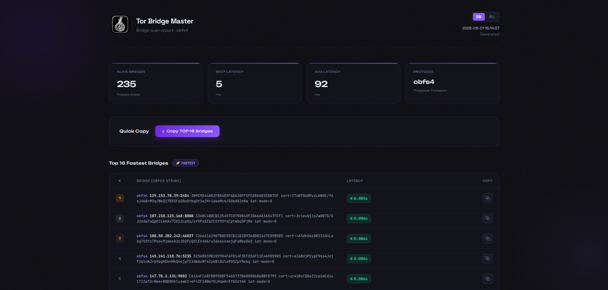
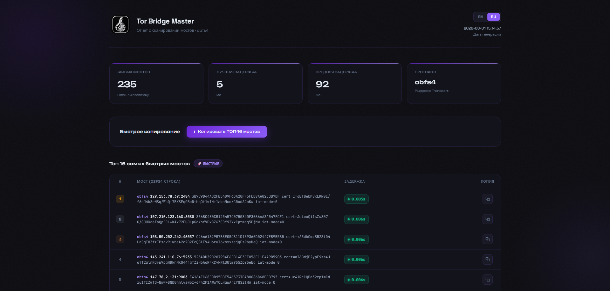

# Tor Bridge Master

**[Русский](#русский) · [English](#english)**

---

## Русский

Параллельный сканер мостов **obfs4** для Windows. Скачивает свежий список мостов,
проверяет их и строит красивый HTML-отчёт с топом самых быстрых из них.

  
  

### Как проверяются мосты
1. **TCP-connect** — подтверждает, что порт открыт, и измеряет задержку (RTT).
2. **obfs4-хендшейк** — поднимает временный `tor` с единственным мостом и ждёт `Bootstrapped 100%`,
   то есть мост действительно рабочий как obfs4, а не просто открытый порт.

Если `tor`/`obfs4proxy` не установлены, шаг 2 пропускается с предупреждением — остаётся только
TCP-проверка (флаг `--no-verify` отключает шаг 2 принудительно).

### Зависимости
- **Python 3** (с `pip`) — добавьте в PATH при установке.
- **tqdm** — `pip install -r requirements.txt`.
- **PowerShell 7** (`pwsh`) — для `Start.ps1`.
- **Tor Browser** *(опционально, но рекомендуется)* — даёт `tor` и `obfs4proxy` для реальной проверки.
  Скачать: <https://www.torproject.org/download/>

### Запуск
1. Запустите `Requirements.bat` — проверит и доустановит зависимости.
2. Запустите `Start.ps1` — скачает список мостов, выполнит сканирование и откроет
   `Best_Bridges.html` в браузере.

### Параметры `src/Main.py`
| Флаг | По умолчанию | Описание |
|------|--------------|----------|
| `--max-workers` | 10 | число потоков |
| `--top` | 16 | размер топа быстрых мостов |
| `--tcp-timeout` | 5 | таймаут TCP-connect, сек |
| `--obfs4-timeout` | 30 | таймаут obfs4-хендшейка, сек |
| `--no-verify` | — | только TCP-проверка (быстрее) |

### Благодарности
- <https://github.com/Delta-Kronecker/Tor-Bridges-Collector>
- <https://gist.github.com/Satyani/409d5f14a6cd2ab57024e5c7326ca78a>
- Author: [tglagcs](https://github.com/tglagcs)

---

## English

Parallel **obfs4** bridge scanner for Windows. Downloads a fresh bridge list,
verifies the bridges and builds a polished HTML report with a top list of the fastest of them.

  
  

### How bridges are verified
1. **TCP connect** — confirms the port is open and measures latency (RTT).
2. **obfs4 handshake** — spins up a temporary `tor` with a single bridge and waits for
   `Bootstrapped 100%`, proving the bridge actually works as obfs4 (not just an open port).

If `tor`/`obfs4proxy` are missing, step 2 is skipped with a warning — only the TCP check remains
(the `--no-verify` flag disables step 2 on purpose).

### Requirements
- **Python 3** (with `pip`) — add it to PATH during installation.
- **tqdm** — `pip install -r requirements.txt`.
- **PowerShell 7** (`pwsh`) — for `Start.ps1`.
- **Tor Browser** *(optional but recommended)* — provides `tor` and `obfs4proxy` for real verification.
  Download: <https://www.torproject.org/download/>

### Usage
1. Run `Requirements.bat` — checks and installs dependencies.
2. Run `Start.ps1` — downloads the bridge list, scans, and opens
   `Best_Bridges.html` in your browser.

### `src/Main.py` options
| Flag | Default | Description |
|------|---------|-------------|
| `--max-workers` | 10 | worker threads |
| `--top` | 16 | size of the fastest-bridges top list |
| `--tcp-timeout` | 5 | TCP connect timeout, sec |
| `--obfs4-timeout` | 30 | obfs4 handshake timeout, sec |
| `--no-verify` | — | TCP check only (faster) |

### Credits
- <https://github.com/Delta-Kronecker/Tor-Bridges-Collector>
- <https://gist.github.com/Satyani/409d5f14a6cd2ab57024e5c7326ca78a>
- Author: [tglagcs](https://github.com/tglagcs)
